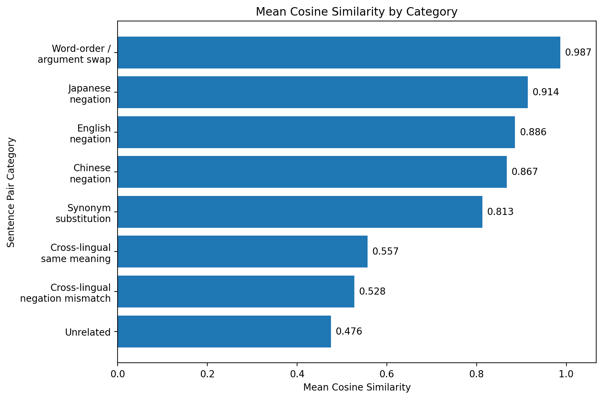
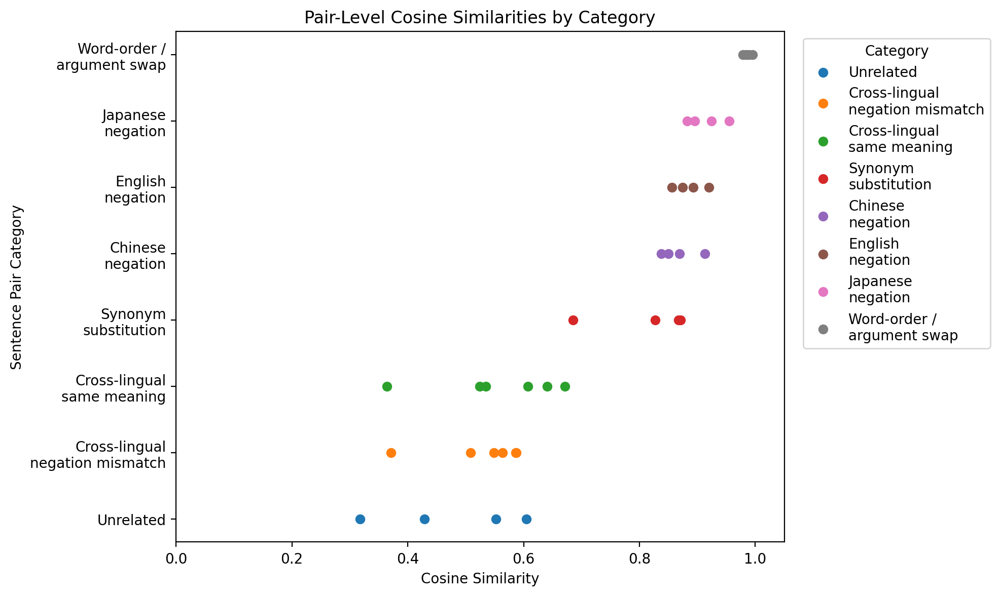

# Multilingual Embedding Experiment

This is a simple, mechanistic interpretability inspired exploration of multilingual sentence embeddings. This project uses a multilingual transformer model and analyzes English, Chinese, and Japanese sentence embeddings that are related through translation, negation, synonyms, or word order.

## Main Question

How does a multilingual embedding model represent semantic similarity across languages, and does it distinguish meaning-changing edits such as negation or argument reversal?

## Experiment Plan

1. Generate a small dataset of sentence pairs, grouped by category (listed below)
2. Extract embeddings using a multilingual transformer model
3. Compare sentence pairs using cosine similarity

## Dataset

The dataset contains 36 manually created sentence pairs across English, Chinese, and Japanese.

Each row includes:

- `sentence_1`
- `sentence_2`
- `language_1`
- `language_2`
- `category`
- `expected_similarity`

The categories are:

| Category | Description |
|---|---|
| `cross_lingual_same_meaning` | Translated sentence pairs with the same meaning |
| `cross_lingual_negation_mismatch` | Cross-lingual pairs where one sentence is negated |
| `english_negation` | English affirmative/negative sentence pairs |
| `chinese_negation` | Chinese affirmative/negative sentence pairs |
| `japanese_negation` | Japanese affirmative/negative sentence pairs |
| `synonym_substitution` | English pairs with similar meaning but different word choice |
| `word_order_argument_swap` | English pairs where the subject/object roles are reversed |
| `unrelated` | Sentence pairs with unrelated meanings |

## Initial Predictions

| Category | Expected Similarity | Reason |
|---|---:|---|
| `cross_lingual_same_meaning` | High | The two sentences are translations with the same meaning. |
| `synonym_substitution` | High | The wording changes, but the meaning is mostly preserved. |
| `cross_lingual_negation_mismatch` | Low | One sentence is negated, so the meaning changes. |
| `english_negation` | Low | Negation changes the truth conditions of the sentence. |
| `chinese_negation` | Low | Negation changes the truth conditions of the sentence. |
| `japanese_negation` | Low | Negation changes the truth conditions of the sentence. |
| `word_order_argument_swap` | Low | Reversing subject/object roles changes who is doing the action. |
| `unrelated` | Low | The sentences discuss different topics. |

My original expectation was that same-meaning translations and synonym pairs would have the highest similarity, while negation pairs, role-reversal pairs, and unrelated pairs would have lower similarity.

## 1st Experiment

I used `bert-base-multilingual-cased` from Hugging Face Transformers.

For each sentence:

1. Tokenized the sentence.
2. Passed it through multilingual BERT.
3. Used mean pooling over the final hidden states to create one sentence embedding.
4. Compared sentence embeddings using cosine similarity.

### Results

| Category | Expected Similarity | Mean Similarity |
|---|---:|---:|
| `cross_lingual_same_meaning` | High | 0.5572 |
| `synonym_substitution` | High | 0.8128 |
| `cross_lingual_negation_mismatch` | Low | 0.5279 |
| `english_negation` | Low | 0.8859 |
| `chinese_negation` | Low | 0.8674 |
| `japanese_negation` | Low | 0.9142 |
| `word_order_argument_swap` | Low | 0.9868 |
| `unrelated` | Low | 0.4758 |

The categories above are listed in the order of expected similarity from high to low. Unexpectedly, the highest average similarity came from the word-order/argument-swap category.

For example:

    The boy chased the girl.
    The girl chased the boy.

These two sentences have different meanings because the roles are reversed. However, they contain nearly the same words, and the mean-pooled mBERT embeddings gave them very high similarity.

Negation pairs were also much higher than expected. For example:

    The cat is sleeping.
    The cat is not sleeping.

These two sentences differ logically, but they still share most of their words. The model representation remained highly similar.

Cross-lingual same-meaning pairs were only moderately similar. They scored higher than unrelated pairs, but much lower than monolingual negation or role-reversal pairs.

### Visualization

The bar chart shows that several categories predicted to have low similarity, especially word-order/argument swaps and negation pairs, received the highest cosine similarity scores. This suggests that mean-pooled mBERT embeddings may be more sensitive to word overlap and topic similarity than to precise logical meaning.

The pair-level plot shows that there is some variation within each type of sentence pair. However, the high similarity scores for negation and role-reversal pairs were not caused by a single outlier and most examples in those categories clustered at high similarity.

### Interpretation

These results suggest that mean-pooled multilingual BERT embeddings capture surface-level or topical similarity more strongly than precise logical meaning.

In this setup, high cosine similarity did not always mean that two sentences had the same meaning. Sentences with nearly identical words often received very high similarity, even when their meanings changed through negation or role reversal.

The cross-lingual results were also interesting. Same-meaning translated pairs scored only slightly higher than cross-lingual negation mismatches:

| Category | Mean Similarity |
|---|---:|
| `cross_lingual_same_meaning` | 0.5572 |
| `cross_lingual_negation_mismatch` | 0.5279 |

This suggests that basic mean-pooled mBERT embeddings may not be enough to clearly distinguish cross-lingual semantic equivalence from cross-lingual logical mismatch.

### Main Takeaway

A pair of sentences can receive high similarity because they share words, topics, or structure, even if their precise meaning is different. This makes simple embedding comparisons useful for exploring model behavior, but limited as a measure of true semantic understanding.

### Limitations

- The dataset is small and manually created.
- The experiment only uses English, Chinese, and Japanese.
- The method uses mean pooling over multilingual BERT token embeddings.
- Cosine similarity gives behavioral evidence, not a causal explanation of the model.
- This is not a full mechanistic interpretability study because it does not inspect attention heads, circuits, activations, or internal causal mechanisms.

Because of these limitations, the results should not be treated as final conclusions about multilingual BERT. Instead, they show patterns worth investigating and help illustrate the limits of simple embedding-based analysis.

### Next Steps

1. Expanding the dataset with more sentence pairs.
2. Testing a sentence-transformer model trained specifically for semantic similarity.
3. Comparing CLS-token embeddings against mean-pooled embeddings.
4. Adding more controlled examples for negation and role reversal.
5. Creating visualizations of category-level similarity patterns.